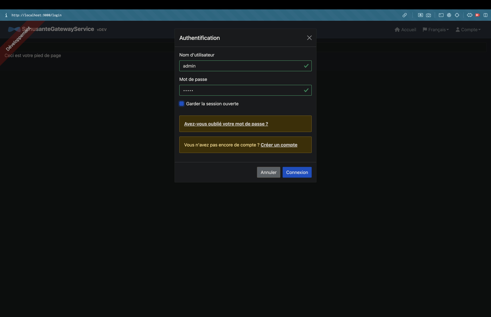
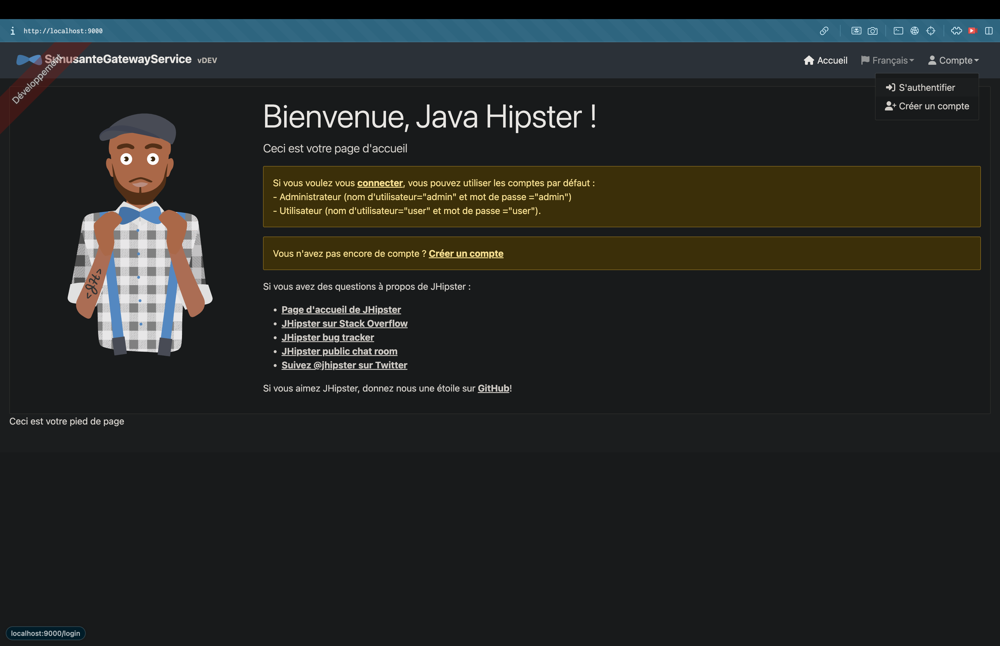
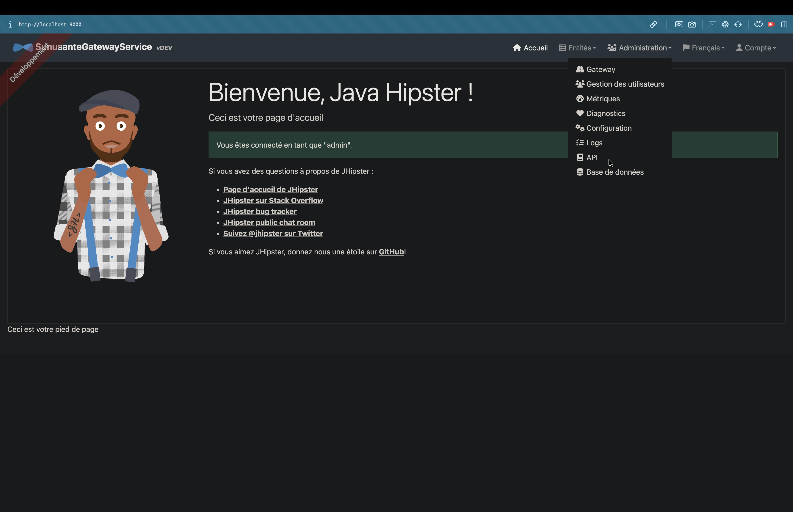
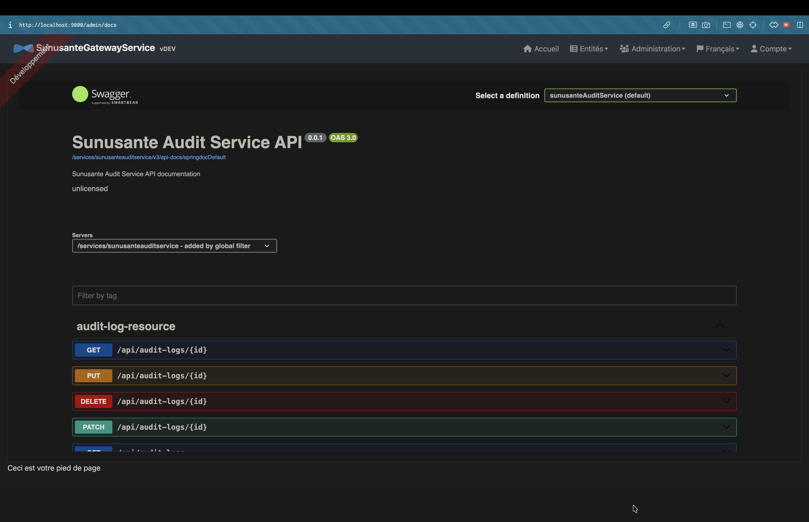

# Sunusante - Lancement local (Gateway + Microservices)

Ce guide permet de demarrer en local :

- Infrastructure Docker via `deploy.yml` :
  - JHipster Registry
  - Kafka
  - Zookeeper
- Applications Java (mode `dev`) :
  - Gateway (`sunusante-gateway-service`)
  - Patient Service (`sunusante-patient-service`)
  - DMP Service (`sunusante-dmp-service`)
  - Audit Service (`sunusante-audit-service`)

## Prerequis

- Java 17+ (ou version compatible du projet)
- Docker + Docker Compose
- Droits d'execution sur les wrappers Maven (`mvnw` / `mvnw.cmd`)

## Fichiers fournis

- Unix/macOS : `start-all.sh`, `stop-all.sh`
- Windows : `start-all.bat`, `stop-all.bat`

## Demarrage

### Demarrage pas a pas par service

Les commandes ci-dessous sont a executer **sequentiellement**. Pour chaque microservice, on demarre d'abord le backend Java. Pour la Gateway, on demarre ensuite le frontend avec `npm start` si l'interface GUI est souhaitee.

#### 1) Patient Service

```bash
cd sunusante-patient-service
./mvnw -DskipTests -Dspring-boot.run.profiles=dev spring-boot:run
```

#### 2) DMP Service

```bash
cd sunusante-dmp-service
./mvnw -DskipTests -Dspring-boot.run.profiles=dev spring-boot:run
```

#### 3) Audit Service

```bash
cd sunusante-audit-service
./mvnw -DskipTests -Dspring-boot.run.profiles=dev spring-boot:run
```

#### 4) Gateway backend

```bash
cd sunusante-gateway-service
./mvnw -DskipTests -Dspring-boot.run.profiles=dev spring-boot:run
```

#### 5) Gateway frontend (GUI)

```bash
cd sunusante-gateway-service
npm install
npm start
```

### Unix/macOS via scripts

```bash
chmod +x start-all.sh
./start-all.sh
```

### Windows (cmd) via scripts

```bat
start-all.bat
```

Le front de la Gateway est servi sur `http://localhost:9060` (proxy vers la Gateway backend en `9040`).

## URLs utiles

- JHipster Registry: http://localhost:8761
- Gateway (backend): http://localhost:9040
- Gateway (GUI via npm start): http://localhost:9060
- Swagger dans l'interface Gateway: http://localhost:9060/admin/docs
- Patient Service: http://localhost:9041
- DMP Service: http://localhost:9042
- Audit Service: http://localhost:9043

## Captures d'ecran

Les images ci-dessous suivent un parcours utilisateur simple: connexion, navigation dans la Gateway, puis accès aux pages Swagger.

### Ecran de connexion



### Vue non authentifiee



### Menu principal apres connexion


### Entree de menu API



### Accueil Swagger / OpenAPI



### Selecteur de services Swagger


## Logs

Les logs sont ecrits dans `logs/` a la racine :

- `logs/gateway.log`
- `logs/patient.log`
- `logs/dmp.log`
- `logs/audit.log`

## Arret

### Arreter l'infrastructure Docker

```bash
docker compose -f sunusante-gateway-service/src/main/docker/deploy.yml down
```

### Arret rapide via scripts

Unix/macOS:

```bash
chmod +x stop-all.sh
./stop-all.sh
```

Windows (cmd):

```bat
stop-all.bat
```

### Arreter les applications Java

Les scripts lancent les applications en arriere-plan (Unix) ou en nouvelles fenetres (Windows).

- Unix/macOS : utiliser l'IDE, un `pkill`, ou tuer les PID Java.
- Windows : fermer les fenetres ouvertes ou tuer les processus Java.

Exemple macOS (par ports) :

```bash
kill -9 $(lsof -ti :9040 :9041 :9042 :9043)
```

## Notes

- Le fichier Docker utilise est `sunusante-gateway-service/src/main/docker/deploy.yml`.
- Les applications sont lancees avec le profil Spring `dev`.
- D'apres les configs jointes, chaque service expose ces ports en dev :
  - Gateway: `9040`
  - Patient: `9041`
  - DMP: `9042`
  - Audit: `9043`
